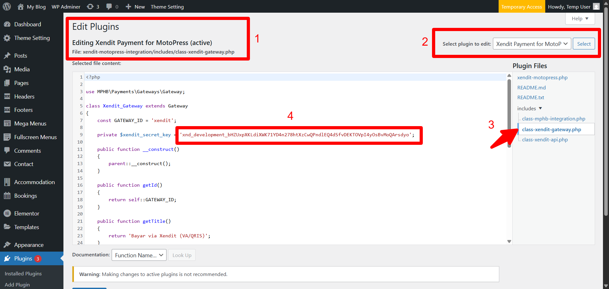

Got it ✅ — you want the **same flow as the Indonesian version** (Description → Installation → Configuration → FAQ → Screenshots → Changelog → Credits) but written in **English**, and still using **emoji and formatting** like your earlier styled version.

Here’s the full English version with the requested flow:

---

# Xendit MotoPress Integration

Integrate **Xendit Payment Gateway** with **MotoPress Hotel Booking**, allowing hotel guests to pay via Bank Transfer, E-Wallets, QRIS, and other payment methods supported by Xendit.

---

## 📝 Description

This plugin adds the Xendit payment method to MotoPress Hotel Booking with features such as:

* Payments via Bank Transfer, E-Wallets, QRIS
* Automatic booking confirmation after successful payment
* Payment status automatically updated to **Completed**
* Support for success and failure redirect URLs
* REST API Webhook endpoint for payment status updates
* Available in both Sandbox and Live modes

---

## 📥 Installation

1. Download the plugin ZIP file.
2. Go to **WordPress Admin → Plugins → Add New → Upload Plugin**.
3. Upload the ZIP file and click **Install Now**.
4. Activate the plugin.
5. Make sure **MotoPress Hotel Booking** is already active.

---

## ⚙️ Configuration

### 1. Get Your Xendit API Key

1. Log in to [Xendit Dashboard](https://dashboard.xendit.co/).
2. Go to **Settings → API Keys**.
3. Copy your **Secret API Key**.

### 2. Replace API Key in the Plugin

Open the file:
/wp-content/plugins/xendit-motopress-integration/includes/class-xendit-gateway.php

Initialize the API:
private \$xendit\_secret\_key = 'xnd\_development\_xxxxxxx'; // Replace with your API Key

💡 Use the **Development Key** for testing and the **Live Key** for production.

### 3. Register Webhook in Xendit Dashboard

1. Go to **Settings → Callbacks → Invoice Paid Callback URL**.
2. Enter this URL:
   [https://yourdomain.com/wp-json/xendit/v1/webhook](https://yourdomain.com/wp-json/xendit/v1/webhook)
3. Save changes.

---

## ❓ Frequently Asked Questions

**Q: Why is my booking status still Pending?**
A: Please ensure that:

* The webhook is active and accessible (must use HTTPS).
* The log file in `wp-content/debug.log` shows no errors.
* The API Key is valid and matches the selected mode (Sandbox/Live).

**Q: Does the plugin support QRIS?**
A: Yes, the plugin supports all payment methods provided by Xendit, including QRIS.

**Q: How can I check the payment status in the admin panel?**
A: Go to **Hotel Booking → Payments** in the WordPress admin. After the webhook succeeds, the status will automatically update to **Completed**.

---

## 📸 Screenshots

**1. Upload Plugin**
WordPress Admin → Plugins → Add New → Upload Plugin.
Show the Xendit plugin ZIP being uploaded.

**2. Plugin Installed & Activated**
Confirmation screen showing plugin installed successfully and **Activate Plugin** button.

**3. Active Plugins List**
WordPress Admin → Plugins page.
Show **Xendit MotoPress Integration** listed as active.

**4. Payment Settings in MotoPress**
WordPress Admin → Hotel Booking → Settings → Payments.
Highlight **Xendit** as a payment method.

**5. Xendit Dashboard – API Keys**

* Log in to [Xendit Dashboard](https://dashboard.xendit.co/).
* Navigate to **Settings → API Keys**.
* Show where the **Secret API Key** is copied.
  

**6. WordPress Plugin File – API Key Setup**

* Open `/wp-content/plugins/xendit-motopress-integration/includes/class-xendit-gateway.php`.
* Highlight the line:
  `private $xendit_secret_key = 'xnd_development_xxxxxxx'; // Replace with your API Key`
* (Optional: blur out the actual key for security).
  

**7. Xendit Dashboard – Webhook Settings**

* Go to **Settings → Callbacks → Invoice Paid Callback URL**.
* Enter:
  `https://yourdomain.com/wp-json/xendit/v1/webhook`

---

## 📌 Changelog

### 1.0.0

* Initial release: Integration of Xendit Payment Gateway with MotoPress Hotel Booking

---

## 👨‍💻 Credits

* **Hotel Booking System**: [MotoPress Hotel Booking](https://motopress.com/products/hotel-booking/)
* **Payment Gateway**: [Xendit](https://xendit.co/)
* **Developed by**: Muhammad Iqbal Basagili (codeirawan)

---
